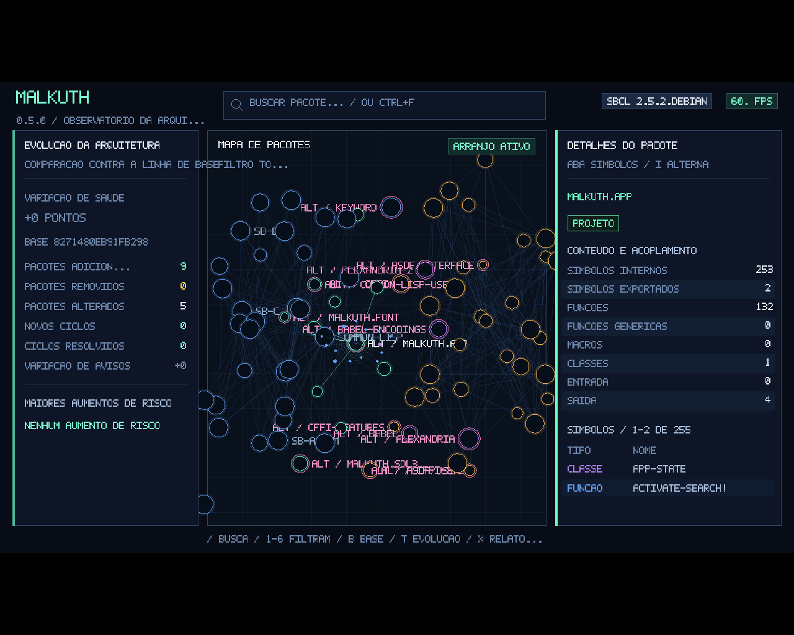

# Malkuth 0.5.0

**Observatório da imagem Common Lisp, analisador de arquitetura por pacotes e gerador de relatórios.**

O Malkuth examina o processo Lisp em execução e transforma seus pacotes em um mapa navegável. Cada pacote vira um nó; relações de `USE-PACKAGE` viram arestas; símbolos, funções, macros, classes e variáveis são classificados. A mesma fotografia alimenta a interface SDL3, análises arquiteturais, relatórios e políticas de integração contínua.



## Novidades da versão 0.5.0

- linha de base persistente para comparar a arquitetura ao longo do tempo;
- histórico rotativo de instantâneos salvo automaticamente antes de cada `F5`;
- painel de evolução com variação de saúde, avisos, ciclos e risco local;
- filtro `6` para mostrar apenas pacotes adicionados ou alterados;
- marca magenta nos pacotes que mudaram desde a linha de base;
- exportação da comparação em Markdown e JSON;
- tabelas CSV de pacotes e dependências incluídas no pacote completo;
- políticas de CI para novos ciclos, regressão de saúde e aumentos de risco;
- persistência segura dos instantâneos em S-expression com `*READ-EVAL*` desativado;
- retenção configurável do histórico por `MALKUTH_HISTORY_RETENTION`.

## Capacidades principais

- reflexão sobre a imagem Common Lisp em execução;
- mapa tridimensional de pacotes e dependências;
- busca textual e seleção direta de pacotes;
- inspeção de símbolos e relações diretas;
- métricas de entrada, saída, conectividade e risco;
- detecção de ciclos por componentes fortemente conexos;
- identificação de pacotes isolados, grandes e excessivamente acoplados;
- pontuação heurística de saúde arquitetural;
- atualização da imagem com histórico e comparação contra linha de base;
- escopo por prefixos de pacotes;
- exportações atômicas SVG, JSON, DOT, Markdown e CSV;
- políticas de arquitetura para CI;
- núcleo utilizável sem SDL3 e CFFI.

## Requisitos

Para o núcleo e os relatórios: Common Lisp com ASDF, preferencialmente SBCL.

Para a interface: CFFI e SDL3 3.2 ou mais recente.

```bash
sudo apt install sbcl cl-cffi libsdl3-0 libsdl3-dev
```

## Execução rápida

```bash
sbcl --script run.lisp
```

Análise sem interface:

```bash
sbcl --script analyze.lisp
```

Somente SVG:

```bash
sbcl --script render-svg.lisp
```

## Controles

| Entrada | Ação |
|---|---|
| Apontar / clicar | Pré-visualizar ou selecionar pacote |
| `/` ou `Ctrl+F` | Ativar a busca de pacotes |
| Digitação | Filtrar resultados em tempo real |
| `↑ / ↓` ou `Tab` | Navegar pelos resultados da busca |
| `Enter` | Abrir o resultado selecionado |
| `Backspace` | Apagar um caractere da consulta |
| `1` | Mostrar todos os pacotes |
| `2` | Mostrar código do projeto |
| `3` | Mostrar pacotes acima do limiar de risco |
| `4` | Mostrar favoritos |
| `5` ou `V` | Mostrar a vizinhança direta da seleção |
| `6` | Mostrar pacotes alterados desde a linha de base |
| `F` | Adicionar ou remover favorito |
| `B` | Capturar o estado atual como linha de base |
| `T` | Abrir ou fechar o painel de evolução |
| `Y` | Exportar a comparação em Markdown e JSON |
| `I` | Alternar símbolos e dependências no inspetor |
| `C` | Exportar dossiê do pacote selecionado |
| `F5` | Reconstruir e comparar a imagem |
| `G` | Alternar diagnósticos |
| `X` | Exportar o pacote completo, incluindo CSV |
| `P` | Exportar rapidamente o SVG |
| `J / K` ou `Tab` | Pacote anterior / próximo no filtro atual |
| `Page Up / Page Down` | Rolar a aba ativa do inspetor |
| `W A S D` | Orbitar câmera |
| `Q / E` | Afastar / aproximar |
| `Espaço` | Pausar ou retomar o arranjo |
| `R` | Reorganizar o grafo |
| `O` | Alternar órbita automática |
| `H` | Ajuda |
| `Esc` | Fechar busca/ajuda; pressionar novamente para encerrar |


## Linha de base, histórico e evolução

Pressione `B` para guardar o instantâneo atual como referência. Depois de carregar código, redefinir funções ou ativar plugins, pressione `F5` para reconstruir a imagem. O Malkuth compara o novo estado com a linha de base e destaca pacotes adicionados ou alterados.

- `T` abre o painel de evolução;
- `6` restringe o mapa aos pacotes alterados;
- `Y` gera `malkuth-comparacao.md` e `malkuth-comparacao.json`;
- cada atualização salva o estado anterior em `output/historico/`;
- a linha de base fica em `output/malkuth-linha-de-base.sexp`.

A retenção padrão é de 20 fotografias:

```bash
MALKUTH_HISTORY_RETENTION=50 sbcl --script run.lisp
```

Consulte [Histórico e comparação](docs/HISTORICO-E-COMPARACAO.md).

## Busca de pacotes

Clique na caixa superior ou pressione `/` ou `Ctrl+F`. Digite parte do nome do pacote e confirme com `Enter`:

```text
MALKUTH.APP
```

A busca não diferencia maiúsculas e minúsculas. Ela prioriza correspondências exatas, prefixos e segmentos pontuados, mas também aceita trechos e subsequências. Por exemplo, `model`, `MALK` e `MLA` podem localizar pacotes relacionados ao Malkuth.

Para iniciar o aplicativo com uma consulta já aberta:

```bash
MALKUTH_INITIAL_SEARCH='MEU-APP.CORE' sbcl --script run.lisp
```

Consulte [Busca de pacotes](docs/BUSCA.md) para detalhes.

## Escopo recomendado

```bash
MALKUTH_SCOPE_PREFIXES='MEU-APP,MINHA-EMPRESA' \
MALKUTH_USER_PREFIXES='MEU-APP,MINHA-EMPRESA' \
sbcl --script run.lisp
```

O limiar usado pelo filtro visual de risco pode ser ajustado:

```bash
MALKUTH_RISK_THRESHOLD=35 sbcl --script run.lisp
```

## Integração contínua

```bash
MALKUTH_SCOPE_PREFIXES='MEU-APP' \
MALKUTH_USER_PREFIXES='MEU-APP' \
MALKUTH_OUTPUT_DIR="$PWD/build/malkuth/" \
MALKUTH_MIN_HEALTH=80 \
MALKUTH_FAIL_ON_CYCLES=true \
MALKUTH_MAX_WARNINGS=5 \
MALKUTH_BASELINE_FILE="$PWD/build/malkuth-baseline.sexp" \
MALKUTH_FAIL_ON_NEW_CYCLES=true \
MALKUTH_MAX_HEALTH_REGRESSION=5 \
MALKUTH_MAX_RISK_INCREASES=3 \
sbcl --script analyze.lisp
```

Códigos de saída: `0` sucesso, `1` erro operacional e `2` política arquitetural violada.

## API programática

```lisp
(asdf:load-system "malkuth/core")

(defparameter *instantaneo* (malkuth.model:build-snapshot))
(defparameter *analise* (malkuth.analysis:analyze-snapshot *instantaneo*))
(defparameter *pacote* (malkuth.model:find-node-by-name *instantaneo* "MEU-APP"))

(malkuth.model:search-nodes *instantaneo* "meu-app" :limit 10)

(malkuth.model:node-dependencies *instantaneo* *pacote*)
(malkuth.model:node-dependents *instantaneo* *pacote*)
(malkuth.model:node-neighbors *instantaneo* *pacote*)

(malkuth.export:export-package-bundle
 *instantaneo* *pacote* #P"build/malkuth/" :analysis *analise*)
```

## Estrutura

```text
src/model.lisp        reflexão, busca, perfis, relações, validação e impressão digital
src/analysis.lisp     métricas, ciclos, avisos, saúde e comparação
src/history.lisp      persistência, histórico e retenção de instantâneos
src/layout.lisp       arranjo tridimensional determinístico
src/svg.lisp          painel SVG autocontido
src/export.lisp       exportações globais e focadas com escrita atômica
src/vector-font.lisp  fonte vetorial 5x7 embutida
src/sdl3.lisp         ponte CFFI mínima para SDL3
src/app.lisp          interface, busca, filtros, favoritos e navegação
analyze.lisp          execução sem interface e políticas de CI
run.lisp              inicializador da interface
```

## Validação

```bash
make test
make analyze
make smoke
make validate
```

## Limitações

- O grafo representa `USE-PACKAGE`; referências totalmente qualificadas não geram arestas.
- O risco e a saúde são heurísticas, não provas de qualidade ou segurança.
- Favoritos são persistidos no diretório de saída e identificados pelo nome do pacote.
- A busca não possui seleção parcial do texto, histórico de consultas ou área de transferência.
- O histórico compara estrutura de pacotes e contagens; ele não preserva funções executáveis nem o estado completo do heap.
- A interface ainda não oferece recursos completos de acessibilidade.
- O Linux é a principal plataforma de validação desta versão.

A documentação completa está em [docs/INDICE.md](docs/INDICE.md).

## Licença

MIT. O texto jurídico oficial permanece em inglês em [LICENSE](LICENSE).
