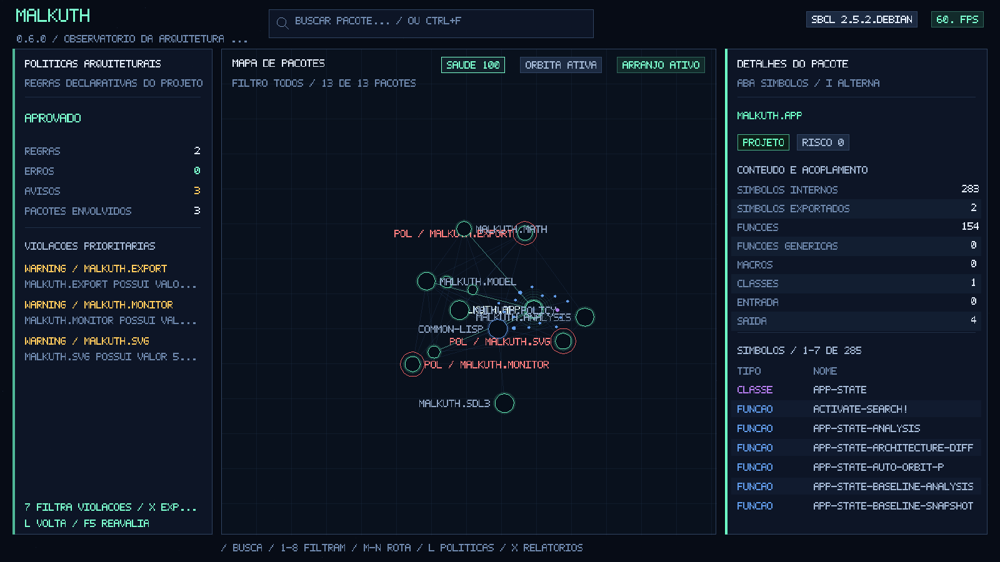

# Malkuth 0.6.1 — English

**Common Lisp image observatory, package-level architecture analyzer, and regression monitor.**

> Documentation: [English](doc-en/INDEX.md) · [Português (Brasil)](doc-ptbr/INDICE.md)

Malkuth inspects the running Lisp process and turns its package structure into a navigable map. Each package becomes a node, `USE-PACKAGE` relationships become edges, and owned symbols, functions, macros, classes, generic functions, and variables are classified. The same snapshot powers the SDL3 interface, architecture analysis, declarative policies, history, monitoring, and CI-ready reports.



## What is new in 0.6.1

- documentation reorganized into `doc-en/` and `doc-ptbr/`;
- complete English and Brazilian Portuguese documentation trees;
- bilingual root README with equivalent project coverage in both languages;
- source-code comment audit to keep comments in Brazilian Portuguese;
- removal of the obsolete `docs/` tree and duplicated documentation assets;
- documentation links validated after the reorganization.

## Main capabilities

- reflection over the running Common Lisp image;
- three-dimensional package and dependency map;
- Unicode text search with direct package selection;
- symbol and direct-relationship inspection;
- fan-in, fan-out, connectivity, local risk, and heuristic health metrics;
- strongly connected component and cycle detection;
- persistent baseline, rotating history, and regression comparison;
- versionable declarative architecture policies;
- shortest dependency paths between packages;
- continuous monitoring of the same long-running Lisp image;
- package-prefix scoping with optional direct boundary dependencies;
- atomic SVG, JSON, DOT, Markdown, and CSV exports;
- portable core that does not require SDL3 or CFFI.

## Requirements

For the core, monitoring, and reports: a Common Lisp implementation with ASDF, preferably SBCL.

For the interactive interface: CFFI and SDL3 3.2 or newer.

```bash
sudo apt install sbcl cl-cffi libsdl3-0 libsdl3-dev graphviz
```

## Quick start

Interactive interface:

```bash
sbcl --script run.lisp
```

Headless architecture analysis:

```bash
sbcl --script analyze.lisp
```

Continuous monitor:

```bash
MALKUTH_SCOPE_PREFIXES='MEU-APP' \
MALKUTH_WATCH_INTERVAL=5 \
sbcl --script watch.lisp
```

SVG only:

```bash
sbcl --script render-svg.lisp
```

## Controls

| Input | Action |
|---|---|
| Point / click | Preview or select a package |
| `/` or `Ctrl+F` | Activate package search |
| `Up / Down`, `Tab`, `Enter` | Navigate and open search results |
| `1` | Show all packages |
| `2` | Show project code |
| `3` | Show packages above the risk threshold |
| `4` | Show favorites |
| `5` or `V` | Show the direct neighborhood |
| `6` | Show packages changed since baseline |
| `7` | Show packages that violate policies |
| `8` | Show only the active architecture path |
| `F` | Add/remove favorite |
| `M` | Mark current package as path source |
| `N` | Compute the shortest path to the selected package |
| `Z` | Clear the active path |
| `U` | Export the path in Markdown and DOT |
| `L` | Open/close the policies panel |
| `B` | Capture current state as baseline |
| `T` | Open/close the evolution panel |
| `Y` | Export comparison against baseline |
| `I` | Toggle symbols/dependencies in the inspector |
| `C` | Export selected-package dossier |
| `F5` | Rebuild, reevaluate, and compare the image |
| `G` | Toggle diagnostics |
| `X` | Export the complete bundle |
| `P` | Quick SVG export |
| `J / K` | Previous/next package in current filter |
| `Page Up / Page Down` | Scroll active inspector tab |
| `W A S D` | Orbit camera |
| `Q / E` | Zoom out/in |
| `Space` | Pause/resume layout |
| `R` | Reheat/reorganize graph |
| `O` | Toggle automatic orbit |
| `H` | Help |
| `Esc` | Close search/help, then exit |

## Architecture policies

Copy and adapt the example policy file:

```bash
cp malkuth-politicas.exemplo.sexp malkuth-politicas.sexp
```

Start the interface with project scope and policies:

```bash
MALKUTH_SCOPE_PREFIXES='MEU-APP' \
MALKUTH_USER_PREFIXES='MEU-APP' \
MALKUTH_POLICY_FILE="$PWD/malkuth-politicas.sexp" \
sbcl --script run.lisp
```

Example:

```lisp
(:id "domain-without-ui"
 :type :forbid-dependency
 :severity :error
 :from "MEU-APP.DOMINIO*"
 :to "MEU-APP.UI*"
 :message "The domain layer must not depend on the UI.")
```

Available rule types:

```text
:forbid-dependency  :require-dependency
:max-fan-out        :max-fan-in
:max-risk           :max-symbols
:forbid-cycle       :layer-order
```

See [Architecture policies](doc-en/POLICIES.md).

## Paths between packages

1. Select the source package and press `M`.
2. Find or select the target.
3. Press `N` to compute a shortest connectivity path.
4. Press `8` to isolate the path and `U` to export it.

The interactive route uses undirected connectivity to answer “how are these subsystems connected?”. The API also supports outgoing and incoming directed paths.

See [Dependency paths](doc-en/PATHS.md).

## History and trends

`F5` saves the previous snapshot in `output/historico/`. A complete export can include:

```text
malkuth-tendencia.csv
malkuth-tendencia.json
malkuth-tendencia.md
```

The time series records health, package count, edges, symbols, cycles, and warnings. See [History and comparison](doc-en/HISTORY-AND-COMPARISON.md).

## Continuous monitoring

`watch.lisp` watches the current Lisp image and exports a comparison whenever its architecture fingerprint changes. It is useful for servers that load plugins, recompile modules, or apply runtime patches.

```bash
MALKUTH_BOOTSTRAP_FILE="$PWD/iniciar-meu-app.lisp" \
MALKUTH_SCOPE_PREFIXES='MEU-APP' \
MALKUTH_OUTPUT_DIR="$PWD/build/malkuth-monitor/" \
MALKUTH_WATCH_INTERVAL=10 \
sbcl --script watch.lisp
```

See [Continuous monitoring](doc-en/MONITORING.md).

## Continuous integration

```bash
MALKUTH_SCOPE_PREFIXES='MEU-APP' \
MALKUTH_USER_PREFIXES='MEU-APP' \
MALKUTH_OUTPUT_DIR="$PWD/build/malkuth/" \
MALKUTH_POLICY_FILE="$PWD/malkuth-politicas.sexp" \
MALKUTH_FAIL_ON_POLICY=true \
MALKUTH_BASELINE_FILE="$PWD/ci/malkuth-baseline.sexp" \
MALKUTH_FAIL_ON_NEW_CYCLES=true \
MALKUTH_MAX_HEALTH_REGRESSION=5 \
MALKUTH_SAVE_HISTORY=true \
MALKUTH_EXPORT_TRENDS=true \
sbcl --script analyze.lisp
```

Exit codes: `0` success, `1` operational/configuration error, `2` architecture gate or policy failure.

## Programmatic API

```lisp
(asdf:load-system "malkuth/core")

(defparameter *snapshot* (malkuth.model:build-snapshot))
(defparameter *analysis* (malkuth.analysis:analyze-snapshot *snapshot*))

(malkuth.model:shortest-dependency-path
 *snapshot* "MEU-APP.UI" "MEU-APP.DOMINIO"
 :direction :either)

(defparameter *rules*
  (malkuth.policy:load-policy-file #P"malkuth-politicas.sexp"))

(defparameter *policy-result*
  (malkuth.policy:evaluate-policies
   *snapshot* *rules* :analysis *analysis*))

(malkuth.export:export-policy-bundle
 *policy-result* #P"build/malkuth/")
```

Embedded monitor:

```lisp
(defparameter *monitor*
  (malkuth.monitor:make-architecture-monitor
   :output-directory #P"build/monitor/"))

(malkuth.monitor:monitor-poll! *monitor*)
```

## Project structure

```text
src/model.lisp        reflection, search, relationships, paths, validation
src/analysis.lisp     metrics, cycles, comparison, trends
src/history.lisp      snapshot persistence and retention
src/policy.lisp       declarative architecture policies
src/export.lisp       global/focused reports, policies, paths, trends
src/monitor.lisp      cooperative image monitoring
src/layout.lisp       deterministic 3D layout
src/svg.lisp          self-contained SVG dashboard
src/vector-font.lisp  embedded 5x7 vector font
src/sdl3.lisp         minimal CFFI bridge to SDL3
src/app.lisp          interface, search, filters, policies, paths
analyze.lisp          headless analysis and CI gates
watch.lisp            continuous headless monitor
run.lisp              interactive launcher
doc-en/               English documentation
doc-ptbr/             Brazilian Portuguese documentation
assets/                shared non-language-specific assets
```

## Validation

```bash
make test
make analyze
make smoke
make validate
```

## Limitations

- The graph models `USE-PACKAGE`; fully qualified symbol references do not create edges.
- A path in `:either` mode shows connectivity and may traverse an edge in the reverse direction.
- Risk, health, and policies are review aids, not proofs of correctness or security.
- The monitor observes changes inside the same Lisp image; it does not inspect another process.
- Reports and history may contain internal package and symbol names.
- Linux is the primary validation platform for this release.

Complete English documentation: [doc-en/INDEX.md](doc-en/INDEX.md).

## License

MIT. The official legal text is in [LICENSE](LICENSE).

---

# Malkuth 0.6.1 — Português (Brasil)

**Observatório da imagem Common Lisp, analisador de arquitetura por pacotes e monitor de regressões.**

> Documentação: [Português (Brasil)](doc-ptbr/INDICE.md) · [English](doc-en/INDEX.md)

O Malkuth examina o processo Lisp em execução e transforma seus pacotes em um mapa navegável. Cada pacote vira um nó; relações de `USE-PACKAGE` viram arestas; símbolos, funções, macros, classes e variáveis são classificados. A mesma fotografia alimenta a interface SDL3, análises arquiteturais, políticas declarativas, histórico e relatórios para CI.


## Novidades da versão 0.6.1

- documentação reorganizada em `doc-ptbr/` e `doc-en/`;
- documentação completa em português do Brasil e em inglês;
- README bilíngue com duas metades completas e equivalentes;
- auditoria dos comentários do código-fonte para mantê-los em pt-BR;
- remoção da árvore antiga `docs/` e de artefatos documentais duplicados;
- validação dos links após a reorganização.

## Capacidades principais

- reflexão sobre a imagem Common Lisp em execução;
- mapa tridimensional de pacotes e dependências;
- busca textual Unicode e seleção direta de pacotes;
- inspeção de símbolos e relações diretas;
- métricas de entrada, saída, conectividade e risco;
- detecção de ciclos por componentes fortemente conexos;
- linha de base, histórico rotativo e comparação de regressões;
- políticas arquiteturais versionáveis para interface e CI;
- menor caminho de conectividade entre pacotes;
- monitoramento contínuo da própria imagem Lisp;
- escopo por prefixos de pacotes;
- exportações atômicas SVG, JSON, DOT, Markdown e CSV;
- núcleo utilizável sem SDL3 e CFFI.

## Requisitos

Para o núcleo, monitor e relatórios: Common Lisp com ASDF, preferencialmente SBCL.

Para a interface: CFFI e SDL3 3.2 ou mais recente.

```bash
sudo apt install sbcl cl-cffi libsdl3-0 libsdl3-dev graphviz
```

## Execução rápida

```bash
sbcl --script run.lisp
```

Análise sem interface:

```bash
sbcl --script analyze.lisp
```

Monitor contínuo:

```bash
MALKUTH_SCOPE_PREFIXES='MEU-APP' \
MALKUTH_WATCH_INTERVAL=5 \
sbcl --script watch.lisp
```

Somente SVG:

```bash
sbcl --script render-svg.lisp
```

## Controles

| Entrada | Ação |
|---|---|
| Apontar / clicar | Pré-visualizar ou selecionar pacote |
| `/` ou `Ctrl+F` | Ativar a busca de pacotes |
| `↑ / ↓`, `Tab`, `Enter` | Navegar e abrir resultados |
| `1` | Mostrar todos os pacotes |
| `2` | Mostrar código do projeto |
| `3` | Mostrar pacotes acima do limiar de risco |
| `4` | Mostrar favoritos |
| `5` ou `V` | Mostrar a vizinhança direta |
| `6` | Mostrar pacotes alterados desde a linha de base |
| `7` | Mostrar pacotes que violam políticas |
| `8` | Mostrar somente a rota arquitetural ativa |
| `F` | Adicionar ou remover favorito |
| `M` | Marcar o pacote atual como origem do caminho |
| `N` | Calcular a menor rota até o pacote selecionado |
| `Z` | Limpar a rota |
| `U` | Exportar a rota em Markdown e DOT |
| `L` | Abrir ou fechar o painel de políticas |
| `B` | Capturar o estado atual como linha de base |
| `T` | Abrir ou fechar o painel de evolução |
| `Y` | Exportar a comparação com a linha de base |
| `I` | Alternar símbolos e dependências no inspetor |
| `C` | Exportar dossiê do pacote selecionado |
| `F5` | Reconstruir, reavaliar e comparar a imagem |
| `G` | Alternar diagnósticos |
| `X` | Exportar o pacote completo |
| `P` | Exportar rapidamente o SVG |
| `J / K` | Pacote anterior / próximo no filtro atual |
| `Page Up / Page Down` | Rolar a aba ativa do inspetor |
| `W A S D` | Orbitar câmera |
| `Q / E` | Afastar / aproximar |
| `Espaço` | Pausar ou retomar o arranjo |
| `R` | Reorganizar o grafo |
| `O` | Alternar órbita automática |
| `H` | Ajuda |
| `Esc` | Fechar busca/ajuda; depois encerrar |

## Políticas arquiteturais

Copie o exemplo e adapte os padrões:

```bash
cp malkuth-politicas.exemplo.sexp malkuth-politicas.sexp
```

Abra a interface com as regras:

```bash
MALKUTH_SCOPE_PREFIXES='MEU-APP' \
MALKUTH_USER_PREFIXES='MEU-APP' \
MALKUTH_POLICY_FILE="$PWD/malkuth-politicas.sexp" \
sbcl --script run.lisp
```

Exemplo de regra:

```lisp
(:id "dominio-sem-ui"
 :type :forbid-dependency
 :severity :error
 :from "MEU-APP.DOMINIO*"
 :to "MEU-APP.UI*"
 :message "A camada de domínio não pode depender da interface.")
```

Tipos disponíveis:

```text
:forbid-dependency  :require-dependency
:max-fan-out        :max-fan-in
:max-risk           :max-symbols
:forbid-cycle       :layer-order
```

Consulte [Políticas arquiteturais](doc-ptbr/POLITICAS.md).

## Caminhos entre pacotes

1. Selecione a origem e pressione `M`.
2. Localize ou selecione o destino.
3. Pressione `N` para calcular a menor rota de conectividade.
4. Use `8` para isolar a rota e `U` para exportá-la.

A rota interativa usa conectividade não orientada para responder “como estes subsistemas estão ligados?”. A API também suporta caminhos orientados de saída e entrada.

Consulte [Caminhos de dependência](doc-ptbr/CAMINHOS.md).

## Histórico e tendências

`F5` salva o instantâneo anterior em `output/historico/`. O pacote completo exporta:

```text
malkuth-tendencia.csv
malkuth-tendencia.json
malkuth-tendencia.md
```

A série registra saúde, pacotes, ligações, símbolos, ciclos e avisos. Consulte [Histórico e comparação](doc-ptbr/HISTORICO-E-COMPARACAO.md).

## Monitor contínuo

`watch.lisp` observa a própria imagem Lisp e exporta uma comparação sempre que a impressão digital muda. Ele é especialmente adequado a servidores que carregam plugins, recompilam módulos ou aplicam correções em tempo de execução.

```bash
MALKUTH_BOOTSTRAP_FILE="$PWD/iniciar-meu-app.lisp" \
MALKUTH_SCOPE_PREFIXES='MEU-APP' \
MALKUTH_OUTPUT_DIR="$PWD/build/malkuth-monitor/" \
MALKUTH_WATCH_INTERVAL=10 \
sbcl --script watch.lisp
```

Consulte [Monitoramento contínuo](doc-ptbr/MONITORAMENTO.md).

## Integração contínua

```bash
MALKUTH_SCOPE_PREFIXES='MEU-APP' \
MALKUTH_USER_PREFIXES='MEU-APP' \
MALKUTH_OUTPUT_DIR="$PWD/build/malkuth/" \
MALKUTH_POLICY_FILE="$PWD/malkuth-politicas.sexp" \
MALKUTH_FAIL_ON_POLICY=true \
MALKUTH_BASELINE_FILE="$PWD/ci/malkuth-baseline.sexp" \
MALKUTH_FAIL_ON_NEW_CYCLES=true \
MALKUTH_MAX_HEALTH_REGRESSION=5 \
MALKUTH_SAVE_HISTORY=true \
MALKUTH_EXPORT_TRENDS=true \
sbcl --script analyze.lisp
```

Códigos de saída: `0` sucesso, `1` erro operacional e `2` política violada.

## API programática

```lisp
(asdf:load-system "malkuth/core")

(defparameter *instantaneo* (malkuth.model:build-snapshot))
(defparameter *analise* (malkuth.analysis:analyze-snapshot *instantaneo*))

(malkuth.model:shortest-dependency-path
 *instantaneo* "MEU-APP.UI" "MEU-APP.DOMINIO"
 :direction :either)

(defparameter *regras*
  (malkuth.policy:load-policy-file #P"malkuth-politicas.sexp"))

(defparameter *politicas*
  (malkuth.policy:evaluate-policies
   *instantaneo* *regras* :analysis *analise*))

(malkuth.export:export-policy-bundle *politicas* #P"build/malkuth/")
```

Monitor embutido:

```lisp
(defparameter *monitor*
  (malkuth.monitor:make-architecture-monitor
   :output-directory #P"build/monitor/"))

(malkuth.monitor:monitor-poll! *monitor*)
```

## Estrutura

```text
src/model.lisp        reflexão, busca, relações, caminhos e validação
src/analysis.lisp     métricas, ciclos, comparação e tendências
src/history.lisp      persistência e retenção de instantâneos
src/policy.lisp       regras arquiteturais declarativas
src/export.lisp       relatórios globais, focados, políticas, rotas e tendências
src/monitor.lisp      monitoramento cooperativo da imagem
src/layout.lisp       arranjo tridimensional determinístico
src/svg.lisp          painel SVG autocontido
src/vector-font.lisp  fonte vetorial 5x7 embutida
src/sdl3.lisp         ponte CFFI mínima para SDL3
src/app.lisp          interface, busca, filtros, políticas e rotas
analyze.lisp          execução sem interface e políticas de CI
watch.lisp            monitor contínuo sem interface
run.lisp              inicializador da interface
```

## Validação

```bash
make test
make analyze
make smoke
make validate
```

## Limitações

- O grafo representa `USE-PACKAGE`; referências totalmente qualificadas não geram arestas.
- A rota no modo `:either` mostra conectividade e pode atravessar uma aresta no sentido inverso.
- O risco, a saúde e as políticas são auxiliares de revisão, não provas de correção ou segurança.
- O monitor observa alterações ocorridas dentro da mesma imagem Lisp; ele não inspeciona outro processo.
- Relatórios e históricos contêm nomes internos de pacotes e símbolos.
- O Linux é a principal plataforma de validação desta versão.

A documentação completa em português está em [doc-ptbr/INDICE.md](doc-ptbr/INDICE.md).

## Licença

MIT. O texto jurídico oficial permanece em inglês em [LICENSE](LICENSE).
